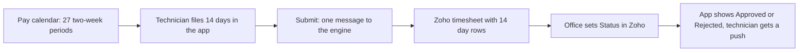

import { Touches } from "/snippets/touches.mdx";
import { Linear } from "/snippets/linear.mdx";

<Touches systems="the-7am-app, supabase-backend, zoho-crm" />

A technician fills in fourteen days of hours in the app, submits, and the same timesheet appears in Zoho a few seconds later; the office approves or rejects it in Zoho, and the app shows the verdict a few seconds after that.

## The shape of it

1. **The pay calendar comes first.** The year's pay periods and holidays are parsed from ADP's PDF (see [Load the year's payroll calendar](/handbook/hours/load-the-payroll-calendar)). Every timesheet names one of those periods: two weeks, Monday to Sunday, with a submit-by date a couple of days after the period ends.
2. **The technician files hours.** One row per day, fourteen rows, weekends usually at zero. The app totals the two weeks and stamps overtime when a week goes past forty hours.
3. **Submit sends one message.** Seen 4 September 2026: a sheet created with its fourteen days and submitted in one go put exactly one message on the engine's queue, and Zoho held the new timesheet with all fourteen day rows five seconds after the submit. Before the fix of <Linear issue="COM-204" /> the same action sent sixteen messages that fought over the day rows until every one of them died.
4. **A later change updates the same Zoho record.** Seen the same day: one day edited from 8 hours to 7.5 sent one message; six seconds later the Zoho timesheet showed 7.5 on that day and 79.5 in total, on the same record with the same fourteen day rows, and its modified time had moved once.
5. **The office decides in Zoho.** Setting **Status** to Approved or Rejected on the Zoho timesheet is what drives the app. The engine takes the status, stamps the approval time itself when Zoho sends none, and pushes "Timesheet Approved" or "Timesheet Rejected" (with the reason) to the technician. See [Approve timesheets and time off](/handbook/hours/approve-timesheets-and-time-off) for the timings observed.
6. **Time off follows the same road.** A time off request goes to Zoho when it is filed; setting its **Status** in Zoho sends the verdict and the review time back, and the technician gets the push.

## Reminders and the deadline

The employee's deadline is the day before the submit-by date. Three timed jobs surround it, all Ottawa time:

| When | What happens |
|---|---|
| 9:00 am, the day before submit-by | "Timesheet Reminder" push to everyone whose sheet for that period is still a draft or does not exist |
| 7:00 pm, the same day | "Urgent: Timesheet Due Now" push to the same people, marked time-sensitive |
| 1:00 am on the submit-by day | The engine submits every sheet still open for that period, with whatever hours it holds |

Seen 4 September 2026 in a rehearsal that was rolled back: a stand-in period due the next day made both reminders address the four technicians who had no sheet for it, with the texts above, and the auto-submit selected nothing for the current period because its submit-by (8 September) was still days away. The first real reminder day on the loaded calendar is 7 September 2026 for the period ending 6 September. Before the fix of <Linear issue="COM-206" /> the reminders went out on the submit-by day itself, eight hours after the auto-submit had already closed the sheet.

The reminder routines have no once-a-day guard of their own: running one twice by hand sends twice. The timer is the guard, so leave them to it.

## Why it works this way

- **One message per change, read when delivered.** The engine drops a new message while an unread one for the same sheet is still waiting, because that message reads the sheet when it is picked up and carries the later change too. This is what turned sixteen racing messages into one.
- **Zoho's Status picklist is the approval.** The office approves by changing a picklist, not by typing a time, so the picklist is what the app listens to. Deriving the status from the time fields would have needed a Zoho workflow nobody has asked for. The decision is recorded on <Linear issue="COM-205" />.
- **The auto-submit is the safety net, not the process.** It only exists so payroll never waits on a forgotten sheet. The two reminders come first so a technician hears twice before the engine submits for them.

## What can go wrong

- **A technician is never reminded.** Check the pay calendar: if no period has a submit-by date tomorrow, the reminders have nothing to select. See [Know when the pay calendar runs out](/handbook/hours/know-when-the-pay-calendar-runs-out).
- **The Zoho timesheet is missing its technician.** The app user must be linked to a Zoho technician. A sheet filed by a user with no such link still syncs, but the **Technician** field in Zoho stays empty (seen 4 September 2026 on the earlier probe sheets).
- **A status set in Zoho does not reach the app.** Look for a dead letter or a failed event on the sheet; see [When an alert email arrives](/handbook/running/when-an-alert-email-arrives).

## Related

- [Approve timesheets and time off](/handbook/hours/approve-timesheets-and-time-off)
- [Load the year's payroll calendar](/handbook/hours/load-the-payroll-calendar)
- [Know when the pay calendar runs out](/handbook/hours/know-when-the-pay-calendar-runs-out)
- [The 7AM app](/systems/the-7am-app)
- [Scheduled jobs](/reference/scheduled-jobs)
- [Statuses](/reference/statuses)
- <Linear issue="COM-89" />
