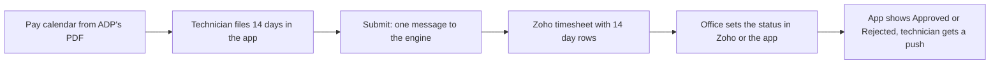

import { Touches } from "/snippets/touches.mdx";

<Touches systems="the-7am-app, supabase-backend, zoho-crm" />

A technician fills in fourteen days of hours in the app and submits. The same timesheet appears in Zoho a few seconds later, the office approves or rejects it in Zoho or in the app, and the technician sees the verdict and gets a push.

## The shape of it

1. **The pay calendar comes first.** The year's pay periods and holidays are read from the schedule PDF published by ADP, the payroll provider; see [Load the year's payroll calendar](/handbook/hours/load-the-payroll-calendar). Every timesheet names one period: fourteen days, Monday to Sunday, with a submit-by date a few days after the period ends. The PDF drives payroll, so the engine reads it two ways and refuses a calendar whose two readings disagree.
2. **The technician files hours.** One number per day. Each statutory holiday in the period is filled with 8 hours by the app. When the sheet is submitted the engine stamps the overtime: every hour past 80 in the period.
3. **Submit sends one message.** The sheet and its fourteen day rows go to Zoho as one timesheet. A later change updates that same Zoho record; while a message for the sheet is still waiting, a further change rides along in it instead of queueing another.
4. **The office decides.** Setting **Status** to Approved or Rejected on the Zoho timesheet, or deciding in the app, is the verdict. The engine stamps the approval time itself when the CRM sends none, and pushes "Timesheet Approved" or "Timesheet Rejected" with the reason to the technician. See [Approve timesheets and time off](/handbook/hours/approve-timesheets-and-time-off).
5. **Time off follows the same road.** A request goes to Zoho when it is filed; setting its **Status** in Zoho or in the app sends the verdict back, and the technician gets "Time Off Approved" or "Time Off Rejected".

## Reminders and the deadline

The technician's deadline is the day before the submit-by date. Three timed jobs surround it. Their clocks are set in UTC, so the Ottawa time shifts by an hour with daylight saving.

| When | What happens |
|---|---|
| 9 am in summer, 8 am in winter, the day before submit-by | "Timesheet Reminder" push to every app user except the super admins whose sheet for that period is still a draft or was never started |
| 7 pm in summer, 6 pm in winter, the same day | "Urgent: Timesheet Due Now" push to the same people |
| 1 am in summer, midnight in winter, on the submit-by day | The engine submits every sheet still in draft or rejected whose deadline has passed, with whatever hours it holds, again leaving the super admins out |

The super admins are left out of all three, the owner among them: they approve hours, they do not file them.

## Why it works this way

- **One message per change, read when delivered.** The message reads the sheet when it is picked up, so it carries every change made before then. Fourteen day rows saved in one go make one push, not fourteen.
- **Zoho's Status picklist is the approval.** The office approves by changing a picklist, not by typing a time, so the picklist is what the app listens to. The app writes the same field, so a decision made there reaches Zoho too.
- **The auto-submit is the safety net, not the process.** It only exists so payroll never waits on a forgotten sheet. The two reminders come first so a technician hears twice before the engine submits for them.

## What can go wrong

- **A technician is never reminded.** Check the pay calendar: if no period has a submit-by date tomorrow, the reminders have nothing to select. See [Know when the pay calendar runs out](/handbook/hours/know-when-the-pay-calendar-runs-out).
- **The Zoho timesheet is missing its technician.** The app user must be linked to a Zoho technician. A sheet filed by a user with no such link still syncs, but the **Technician** field in Zoho stays empty.
- **A status set in Zoho does not reach the app.** The sync failed on the sheet, and the monitor has opened a condition in Sentry. See [Act on a Sentry email](/handbook/running/act-on-a-sentry-email).

## Related

- [Approve timesheets and time off](/handbook/hours/approve-timesheets-and-time-off)
- [Load the year's payroll calendar](/handbook/hours/load-the-payroll-calendar)
- [Know when the pay calendar runs out](/handbook/hours/know-when-the-pay-calendar-runs-out)
- [The 7AM app](/systems/the-7am-app)
- [Scheduled jobs](/reference/scheduled-jobs)
- [Statuses](/reference/statuses)
