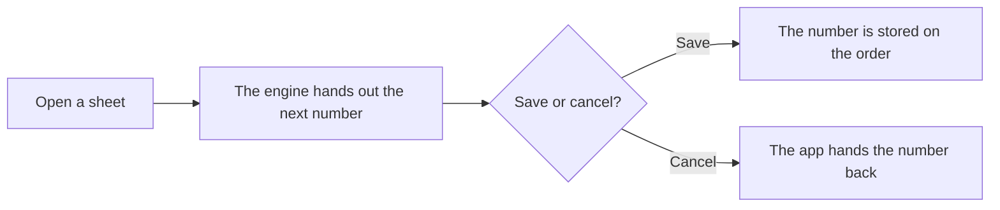

import { Touches } from "/snippets/touches.mdx";

<Touches systems="the-7am-app, supabase-backend" />

Every purchase order number, on a stocking order or a counter purchase order, comes from one counter in the engine, and you get it before you save.

## The shape of it

1. You open a counter purchase order, or reach the order screen from a stock list. The app asks the engine for the next number and shows it, so you can write it on the paperwork at the counter.
2. The engine hands numbers out one at a time. Two people opening a sheet in the same second get two different numbers. A number is the letters PO followed by the count.
3. You save, and the number is stored with the order.
4. You close a counter purchase order without saving, and the app hands the number back. The engine takes a number back only if it is still the newest one handed out and no saved order carries it. Otherwise the number stays used.
5. A stocking order screen you leave without sending does not hand its number back. Deleting a saved order does not either.

## Why it works this way

- The number is ready before saving because the supplier needs it on the paper before the order is placed.
- Stocking orders and counter purchase orders share one counter so there is one series to look up.
- Only the newest number can go back, because handing back an older one could give two orders the same number.

## What can go wrong

- Gaps. A number handed out and never used leaves a gap in the series. Gaps are harmless; what matters is that no number repeats, and the counter never repeats one.

## Related

- [How ordering parts works](/handbook/parts/how-ordering-parts-works)
- [Delete a purchase order](/handbook/parts/delete-a-purchase-order)
- [Order stock from a supplier](/handbook/parts/order-stock)
- [The engine](/systems/supabase-backend)
