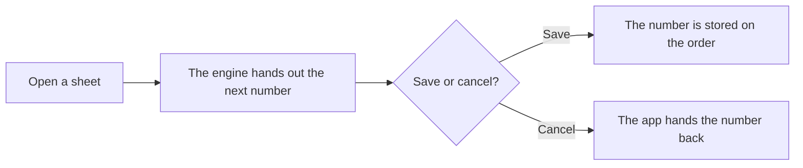

import { Touches } from "/snippets/touches.mdx";
import { Linear } from "/snippets/linear.mdx";

<Touches systems="the-7am-app, supabase-backend" />

Every purchase order number, on a stocking order or a counter purchase order, comes from one counter in the engine, and you get it the moment you open the sheet, before you save.

## The shape of it

1. You open a stocking order or a counter purchase order. The app asks the engine for the next number and shows it, so you can write it on the paperwork at the counter.
2. The engine hands numbers out one at a time. Two people opening a sheet in the same second get two different numbers.
3. You save, and the number is stored with the order. You cancel, and the app hands the number back.
4. The engine takes a number back only if it is still the newest one handed out. Otherwise it keeps it used, and the series has a gap.

## Why it works this way

- The number is ready before saving because the supplier needs it on the paper before the order is placed.
- Stocking orders and counter purchase orders share one counter so there is one series to look up.
- Only the newest number can go back, because handing back an older one could give two orders the same number.

## What can go wrong

- Gaps. A sheet opened and abandoned without the app handing the number back leaves a gap. On 4 September 2026 the counter stood at 1056 while the newest order carrying a number was PO1008: 48 numbers went out and were never used. Gaps are harmless; what matters is that no number repeats.
- Tested 4 September 2026 (<Linear issue="COM-85" />): six numbers taken in a row, PO1057 to PO1062, the last two from two separate connections 2 seconds apart. All consecutive, none repeated. All six went back, newest first, and the counter returned to 1056.

## Related

- [How ordering parts works](/handbook/parts/how-ordering-parts-works)
- [Delete a purchase order and release its number](/handbook/parts/delete-a-purchase-order)
- [Order stock](/handbook/parts/order-stock)
- [The engine](/systems/supabase-backend)
