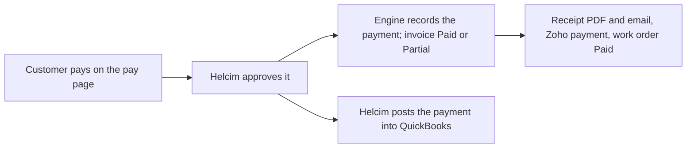

import { Touches } from "/snippets/touches.mdx";

<Touches systems="quickbooks, supabase-backend, zoho-crm, resend" />

A customer pays on the pay page. Helcim is the card processor behind that page: it takes the card or the bank details, and it posts the payment into QuickBooks itself. The engine records the payment the moment Helcim approves it, marks the invoice Paid or Partial, and then does the rest of the paperwork: the receipt, the Zoho payment, the paid work order.

The live pay page is switched off for customers: the engine's merchant record for the live environment has payments turned off, and only the demo one is on. Until the owner turns it on, no payment reaches the engine by any route, and the nightly invoice check reports every invoice whose QuickBooks balance disagrees with ours.

## The shape of it

## What follows a payment

| Step | What happens |
|---|---|
| Approved | The engine writes the payment against the invoice and marks the invoice Paid, or Partial when something is still owed. The pay page shows it at once. |
| Documents | The engine draws the receipt and a fresh copy of the invoice, and files both. |
| Email | "Payment received for INV…" goes to the customer with the receipt and the invoice attached. |
| Zoho | A Payment named after the invoice is made in Zoho with the amount and the method, the receipt attached to it and the invoice PDF attached to the Zoho invoice. The invoice's **Payment Status** follows. |
| Work order | Once nothing is owed, the work order's billing status becomes Paid here and in Zoho. |
| QuickBooks | Helcim posts the payment into QuickBooks under its own reference. The engine never posts a payment there; if it did, every pay-page payment would appear twice. |

A receipt goes out after every payment, including a part payment; it names the amount paid and the balance left.

A bank transfer pays nothing until it clears, which takes days. Nothing follows while it is in progress.

A step that fails after the money is taken is tried again, and dies as a dead letter if it keeps failing. The monitor raises that as an urgent condition in Sentry, because the customer has paid and the paperwork is unfinished. See [Act on a Sentry email](/handbook/running/act-on-a-sentry-email).

## Edits and deletes in Zoho

The engine owns a payment's amount and its method. A value typed over either in Zoho is refused: a human-review flag names the field, and the engine pushes its own value back. Deleting a Payment in Zoho changes nothing here or in QuickBooks; the engine writes nothing and raises a human-review flag, because the record is money that changed hands. See [Resolve a human-review flag](/handbook/running/resolve-a-human-review-flag).

## A payment recorded straight into QuickBooks

QuickBooks never calls the engine, and nothing here goes looking through QuickBooks for payments. A payment the office records there by hand reaches neither this side nor Zoho, and the nightly invoice check opens a condition when the balances disagree.

## Related

- [Take a payment](/handbook/payments/take-a-payment)
- [How invoicing works](/handbook/invoicing/how-invoicing-works)
- [QuickBooks](/systems/quickbooks)
