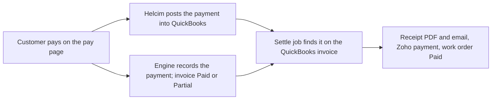

import { Touches } from "/snippets/touches.mdx";

<Touches systems="quickbooks, supabase-backend, zoho-crm, resend" />

A customer pays on the pay page. The engine records the payment the moment Helcim approves it, Helcim posts the same payment into QuickBooks on its own, and the engine's settle job finds it there and finishes the paperwork: receipt, Zoho payment, paid work order.

## The shape of it

## What follows a payment

| Step | What happens |
|---|---|
| Card approved | The engine writes the payment and marks the invoice Paid, or Partial when something is still owed. The pay page shows it at once. |
| QuickBooks | Helcim posts the payment into QuickBooks under its own reference. The engine never posts a payment into QuickBooks itself; if it did, every pay-page payment would appear there twice. |
| Settle | The settle job looks at the QuickBooks invoice for that payment, and asks again until it is there. Once found, it links the two, stores the receipt PDF, emails "Payment received for INV…" with the receipt and the paid invoice attached, and marks the work order Paid here and in Zoho. |
| Zoho | A Payment named after the invoice is made in Zoho with the amount and the method, the receipt attached to it and the paid invoice PDF attached to the Zoho invoice. The invoice's **Payment Status** follows. |

A receipt goes out after every payment, including a part payment; it names the amount paid and the balance left.

A bank transfer is left alone by the settle job until it clears, which takes days; it is settled then.

If QuickBooks still has no such payment two hours after the card was approved, the job gives up and the monitor opens an urgent condition in Sentry. See [Act on a Sentry email](/handbook/running/act-on-a-sentry-email).

## Edits and deletes in Zoho

The engine owns a payment's amount and its method. A value typed over either in Zoho is refused: a human-review flag names the field, and the engine pushes its own value back. Deleting a Payment in Zoho changes nothing here or in QuickBooks; the engine writes nothing and raises a human-review flag, because the record is money that changed hands. See [Resolve a human-review flag](/handbook/running/resolve-a-human-review-flag).

## A payment recorded straight into QuickBooks

The engine has no way to learn about a payment the office records in QuickBooks by hand. Nothing follows from it here or in Zoho, and the nightly invoice check opens a condition when the balances disagree.

## Related

- [Take a payment](/handbook/payments/take-a-payment)
- [How invoicing works](/handbook/invoicing/how-invoicing-works)
- [QuickBooks](/systems/quickbooks)
