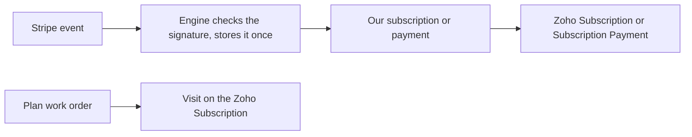

import { Touches } from "/snippets/touches.mdx";

<Touches systems="stripe, supabase-backend, zoho-crm" />

Stripe bills plan customers every month and tells the engine what happened. The engine keeps one subscription here and one Subscription in Zoho, adds a Subscription Payment for every paid Stripe invoice, and writes each plan visit onto the Zoho Subscription's visit list.

## The shape of it

The engine listens to five Stripe events. Each one is checked against Stripe's signature, stored once (a repeat of the same event is ignored), then applied. An older event that arrives after a newer one for the same subscription is skipped.

## What follows each event

| Stripe says | Our side | Zoho |
|---|---|---|
| Subscription created | A subscription with the plan, the monthly amount, the covered visits and the term start | A Subscription named after the customer and the plan: Status, Plan, Monthly Amount |
| Subscription updated (plan changed, paused, past due) | Plan, amount and status follow | The same fields follow; the status each one shows as is on [Statuses](/reference/statuses) |
| Subscription deleted | Status Canceled, with the cancelled-on date | Status Canceled |
| Invoice paid | A subscription payment for that Stripe invoice, once; a zero-amount invoice makes none. The Subscription's roll-up is recomputed: Months Paid counts the payments in the current term, Paid This Term adds them up | A Subscription Payment named "Payment" plus the Stripe invoice id, Status Paid, with the amount, the period and the payment date; the Subscription's Months Paid, Paid This Term, Remaining This Term and Last Payment Date |
| Invoice payment failed | Recorded and left alone: no payment row, no status change. The Past Due status arrives with the subscription update Stripe sends next | Nothing |

**Is Active** on a subscription is the record's on/off switch, used when a Subscription is deleted in Zoho. It stays checked when a plan is cancelled. **Status** is where to look for the plan's state.

## Two rules the engine enforces

- **One live subscription per customer.** The database refuses a second subscription for a customer who already has one switched on. Stripe would have to send one; the engine refuses it, and the failure shows up as an urgent condition in Sentry.
- **One writer for the Zoho Subscription Payment.** Only the engine's sync push makes the Zoho record, keyed on our payment. The Stripe step writes our payment row and nothing in Zoho, so one paid invoice is one Zoho record. A Subscription Payment in Zoho with no Status or no Amount was not made this way.

## Plan visits

A work order counts as a plan visit when its **Subscription** lookup in Zoho names the customer's subscription and its lines are the plan's covered maintenance products. Those lines are priced at nothing. What that makes of the job's billing is on [How invoicing works](/handbook/invoicing/how-invoicing-works).

The engine rebuilds the Subscription's visit list whenever a plan work order, its lines or its appointment change, and once a day for every subscription. The list shows every completed visit, and for each covered item with nothing completed this term one row saying Scheduled when a job is booked or Available when it is still owed.

The Subscription link on a work order belongs to Zoho. Set it there, as the Service calendar does. A link written only on our side is overwritten the next time Zoho sends the work order, and the job loses its plan status.

## A payment typed into Zoho is refused

Stripe is the only way a subscription payment is made. A Subscription Payment typed into Zoho by hand is refused: nothing is written here, and the refusal says the Zoho record can never sync. A value typed in Zoho over a field this side owns on a subscription or a subscription payment is refused the same way: a human-review flag names the field and the engine pushes its own value back. See [Resolve a human-review flag](/handbook/running/resolve-a-human-review-flag).

## What can go wrong

- Stripe's call is refused: the endpoint secret in Stripe and the one the engine holds differ. Rotate them together; see [Environments and secrets](/systems/environments-and-secrets).
- An event names a Stripe product the engine does not know: the event is not applied, and the monitor opens an urgent condition in Sentry. See [Act on a Sentry email](/handbook/running/act-on-a-sentry-email).
- A paid invoice arrives for a subscription the engine has not seen yet: the payment is retried until the subscription lands.
- A live plan covers no items: every visit on it would bill as if the customer had no plan, so the engine raises a human-review flag instead. Set the plan's covered items in Zoho.

## Related

- [How payments work](/handbook/payments/how-payments-work)
- [How booking works](/handbook/booking/how-booking-works)
- [Stripe](/systems/stripe)
- [Zoho CRM](/systems/zoho-crm)
