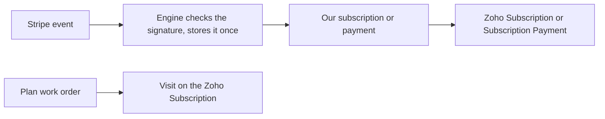

import { Touches } from "/snippets/touches.mdx";
import { Linear } from "/snippets/linear.mdx";

<Touches systems="stripe, supabase-backend, zoho-crm" />

Stripe bills plan customers every month and tells the engine what happened. The engine keeps one subscription here and one Subscription in Zoho, adds a Subscription Payment for every paid invoice, and writes each plan visit onto the Zoho Subscription's visit list.

## The shape of it

The engine listens to five Stripe events: subscription created, subscription updated, subscription deleted, invoice paid, invoice payment failed. Each one is checked against Stripe's signature, stored once (a repeat of the same event is ignored), then applied.

## What follows each event

Seen 4 September 2026 on the probe customer "Probe COM Walker", with Stripe's events replayed by the harness described below:

| Stripe says | Our side | Zoho | How long |
|---|---|---|---|
| New subscription, All-Season, $29.99 a month | Subscription Active with the plan, the amount, the covered visits and the term start | Subscription "Probe COM Walker – All-Season": Active, Plan, Monthly Amount, Covered Services, Term Start and End | 2.8 s here, 2.9 s in Zoho |
| Plan changed to Heating Only, $19.99 | Plan and amount follow | Plan and Monthly Amount follow | 3.0 s here, 3.2 s in Zoho |
| Invoice paid, $19.99 | A subscription payment for the invoice; the roll-up reads Months Paid 1, Paid This Term 19.99 | Subscription Payment "2026-09 · $19.99", Paid, with the payment date; the Subscription's Months Paid, Paid This Term and Last Payment Date | payment 1.8 s here, 3.0 s in Zoho; the roll-up 4.7 s |
| Invoice payment failed | Recorded and left alone: no payment row, no status change | Nothing yet | under 0.1 s |
| Subscription Past Due (the update Stripe sends after the failed payment) | Status Past Due | Status Past Due | 3.5 s here, 3.6 s in Zoho |
| Subscription cancelled | Status Canceled, cancelled-on date set | Status Canceled | 3.0 s here, 3.1 s in Zoho |

Inside the engine each event took between 0.05 and 1.4 seconds to apply; the rest is the queue wake-up and Zoho.

**Is Active** on a subscription is the record's on/off switch, used when a Subscription is deleted in Zoho. It stays checked when a plan is cancelled. **Status** is where to look for the plan's state.

## Plan visits

A work order counts as a plan visit when its **Subscription** lookup in Zoho names the customer's subscription and its lines are the plan's maintenance products. The billing decision itself is on [How booking works](/handbook/booking/how-booking-works).

Seen 4 September 2026, a Routine Furnace Maintenance job on a Heating Only customer, booked and completed from the engine's side:

| Step | What happened | How long |
|---|---|---|
| Job booked with its line | **Billing Status** Non-Billable on both sides | 1.9 s |
| Subscription set on the job | One visit on the Zoho Subscription: Heating, Scheduled, with the work order | 1.9 s after the line landed |
| Job completed | The same visit turned Completed with the day's date | 1.9 s |
| Invoice | None was made | |

The visit is logged once even when the job and its line arrive in the same second (fixed 4 September 2026, <Linear issue="COM-192" />).

The Subscription link on a work order belongs to Zoho. Set it there, as the dispatch calendar does. A link written only on our side is cleared by Zoho's next echo within seconds, so the job loses its plan status.

## A payment typed into Zoho is refused

Stripe is the only way a subscription payment is made. A Subscription Payment typed into Zoho by hand is refused: nothing is written here, and one human-review flag says the Zoho record will never sync. Seen 4 September 2026 in the evening: a $1 Subscription Payment typed on the probe subscription raised the flag 2.5 seconds after it was saved, no row appeared here, and deleting the Zoho record afterwards changed nothing here. Delete such a record in Zoho and close the flag; see [Resolve a human-review flag](/handbook/running/resolve-a-human-review-flag). Until that day the record became a paid row here with a made-up Stripe reference (<Linear issue="COM-196" />).

The same evening, a value typed in Zoho on a field this side owns was refused rather than lost: a payment's method changed to e-Transfer in Zoho raised a flag naming the field 2 seconds later and read Cash again 3 seconds after the edit. Subscriptions and subscription payments follow the same rule (<Linear issue="COM-197" />).

## Known problem: a payment lands twice in Zoho

One paid invoice can become two Subscription Payments in Zoho (<Linear issue="COM-208" />). The Stripe apply and the sync push both create the Zoho record when they run in the same second. Seen twice on 4 September 2026; once it also made a second payment row here, and Months Paid read 2 for one payment. Until it is fixed, look at the Zoho Subscription Payments list after a payment and delete the copy that has no **Status**.

## How to test it

The account holds one live Stripe key and no test-mode key, so a test subscription cannot be billed without charging a real card. The replay harness `scripts/stripe/replay.ts` in the [backend repo](/reference/repos-and-links) plays Stripe instead: it signs the exact events Stripe sends with the real endpoint secret, posts them to the production webhook, then prints our rows, the Zoho copies and how long each took. Its commands are create-subscription, change-plan, invoice-paid, invoice-failed, cancel, status and cleanup. It only accepts a customer whose name starts with "Probe", and cleanup takes back everything it made, Zoho copies included. The command line is in the README beside it.

What the harness cannot prove is Stripe's own side: that a real subscription is created, billed on the day, and its events delivered to our endpoint. That is the owner's step, with a real card in live mode, and it is still owed for <Linear issue="COM-75" />, <Linear issue="COM-76" /> and <Linear issue="COM-77" />.

## What can go wrong

- Stripe's call is refused (HTTP 401): the endpoint secret in Stripe and the one the engine holds differ. Rotate them together; see [Environments and secrets](/systems/environments-and-secrets).
- An event names a Stripe product the engine does not know: the event is not applied and a flag is raised. See [Resolve a human-review flag](/handbook/running/resolve-a-human-review-flag).
- A paid invoice arrives for a subscription the engine has not seen yet: the payment is retried until the subscription lands.

## Related

- [How payments work](/handbook/payments/how-payments-work)
- [How booking works](/handbook/booking/how-booking-works)
- [Stripe](/systems/stripe)
- [Zoho CRM](/systems/zoho-crm)
