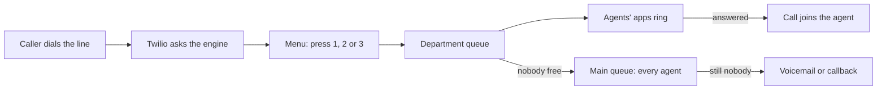

import { Touches } from "/snippets/touches.mdx";

<Touches systems="twilio, supabase-backend, zoho-crm" />

A call comes in to Twilio, Twilio asks the engine what to do, and the engine answers with a menu. The caller picks a department, the department's agents' apps ring, and if nobody answers the caller leaves a voicemail or asks for a callback. Every call, voicemail and text ends up as a record in the engine, and every call gets one call-history record in the CRM.

## The shape of it

1. **The menu.** The engine answers with a greeting and three choices: sales, support, other matters. The caller has 8 seconds to press a key and three tries; after that the line says goodbye and hangs up. Pressing star instead lets the caller dial an [extension](/handbook/phone/reach-an-agent-by-extension).
2. **Open or closed.** Before the queue, the engine checks the department's hours, the holiday list and the closed switch. A closed department plays the closed greeting and takes a voicemail. Support is marked always open. Sales and other matters keep weekday hours. Where those live is on [Change opening hours and holidays](/handbook/phone/change-hours-and-holidays).
3. **The queue.** An open department puts the caller in that department's queue. Each phone agent belongs to one or more departments; an agent with no department set belongs to all of them. The department's agents' apps ring for the department's ring length, 60 seconds. If nobody picks up, the call falls back to the **Main** queue, which every agent can take.
4. **On hold.** While waiting the caller hears hold music and, every 60 seconds, an offer to press 1 for a callback instead. A callback can be to the number they are calling from or to a number they type in. The caller can wait up to the department's limit, 3 minutes for sales and other matters and 4 minutes for support; after that, or if the queue cannot take the call, the line offers voicemail.
5. **Voicemail.** A voicemail can be up to 2 minutes long. Twilio transcribes it, the engine keeps the transcript and copies the recording into its own storage, then deletes Twilio's copy. Card numbers are masked before anything is stored; see [How card numbers stay out of texts and transcripts](/handbook/phone/how-card-numbers-stay-out-of-texts-and-transcripts).
6. **A missed call.** An unanswered call that left no voicemail sends a **Missed call** push to everyone on that line.

An agent's app is what rings; there is no desk phone. A call answered by an agent is recorded from the start and transcribed live, and the transcript is masked the same way a voicemail is.

## Texts

A text to the line lands in a conversation with that number, one conversation per number per line. A photo in a text is copied into the engine's own storage. A reply from the app goes out through the engine's outbox, and Twilio reports back whether it was delivered. Texts never go through the queues or the menu.

## What the CRM gets

Each call becomes one call-history record in the CRM: direction, result, department, start and end, length, the customer or lead the number belongs to, the agent who answered, and links to the recording and the transcript. The engine owns every one of those fields; the CRM reads them and cannot change them, and a call typed into the CRM by hand is not a call here.

## Settings

The line's departments, hours, holidays, menu, spoken prompts and switches all live in the engine. The phone reads them fresh every 30 seconds, so a change is live within half a minute.

## Related

- [Change opening hours and holidays](/handbook/phone/change-hours-and-holidays)
- [Reach an agent by extension or personal line](/handbook/phone/reach-an-agent-by-extension)
- [Twilio](/systems/twilio)
