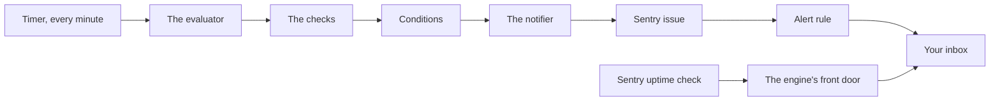

import { Touches } from "/snippets/touches.mdx";

<Touches systems="supabase-backend, sentry" />

Once a minute the engine asks itself a list of questions, and anything it finds wrong stays on a list in Sentry until it sees it fixed.

## The shape of it

Three workers wake every minute on a timer inside the engine. **The evaluator** books every check that is due, then runs the quick ones itself. **The maintenance worker** runs the slow ones from a queue. **The notifier** turns each new problem into one Sentry issue and closes that issue when the problem is gone. Sentry's alert rules decide which issues email you. From the outside, Sentry's own uptime check knocks on the engine's front door once a minute and emails you if nobody answers.

The evaluator books first and runs second. A booking is a row that says "this check was due at this minute", so if the evaluator dies half way, the missing result is still visible to the self-check that looks for it. Quick checks run two at a time, each allowed 12 seconds, the whole minute's batch allowed 30 seconds. Slow checks are booked the same way and handed to the maintenance worker, which takes them off its queue two at a time and gives each up to 70 seconds; a check that has more to do can save its place and continue on the next wake.

## The checks

A check is one question asked on a clock. There are three families.

- **Business checks** look at records: a checkout payment whose outcome is uncertain, a cancelled job that is still collectible, an invoice whose totals disagree with its payments, a payroll calendar about to run out, a timesheet with no pay period, a lead that converted with no customer behind it, a human-review flag nobody has closed, a property with no imagery, a stored text or transcript holding a card number.
- **Work checks** watch the queues: a queued action that passed its deadline or died as a dead letter, a notification or credential rotation with no established outcome.
- **Self-checks** watch the engine's own clockwork: every timer still matches what was deployed, every scheduled database job left evidence that it ran, every check completed on time, and the nightly jobs that run on GitHub reported back.

Quick checks run every minute. The rest run every 5 or 15 minutes, once an hour, or once a night. A few housekeeping jobs also run as checks so that their completion is watched the same way. Every check, its schedule, its weight and the title it gives its issues are on [Monitor checks](/reference/monitor-checks).

## Conditions, and why you get one issue not fifty

A check does not send a message. It reports a list of problems, and each problem is a condition: one check, one kind of problem, one record. The engine keeps one row per condition.

- The first time a check reports a condition, the condition opens and the notifier makes one Sentry issue for it.
- Every later run that reports the same condition changes nothing. Fifty runs of the same problem are still one issue.
- The condition recovers only when a later run of the same check, one that looked at that record, no longer lists it. Then the notifier resolves the issue.
- A run that failed or timed out closes nothing. Only a run that finished can say a problem is gone.

One open stretch of a condition is a spell. When a recovered condition comes back, that is a new spell, and it gets a new Sentry issue with the spell number on it; the old issue stays resolved. A condition that opened as for review and is later reported as urgent is escalated: same spell, same issue, but the issue's level rises and the urgent alert rule sends the email.

## Urgent and for review

Every condition carries one of two weights. **Urgent** means a person should act today. **For review** means it can wait for the weekly look. The weight comes from the check, and some checks decide per record:

- A queued action's weight follows its contract. A critical action must finish within five minutes (300 seconds); a routine one within fifteen minutes (900 seconds). Past its deadline, a critical action is urgent and a routine one is for review.
- A dead letter carries the weight the worker wrote on it when it gave up: urgent when the outcome was uncertain or the action was critical, for review when the refusal was expected. A letter with no weight written on it falls back to its contract.
- A human-review flag is for review, unless it concerns money whose effect is uncertain; then it is urgent.
- Cancelled work is urgent while it is still collectible, and for review once it was paid.
- The payroll calendar is for review while it is running low and urgent once it has run out.
- A timer changed by hand is urgent; a timer nobody deployed is for review.

| Urgent | For review |
|---|---|
| Emails you on every event of the spell, through the urgent rule | Emails you once, when the spell opens, and again only if it comes back |
| Shows in Sentry as an error | Shows in Sentry as a warning |
| Uncertain or overdue payments, cancelled work still collectible, a payroll calendar that ran out, a timesheet with no period, a card number in stored text, a critical action late or dead, a timer changed by hand | Invoice totals that disagree, a lead with no customer behind it, a plain human-review flag, a property without imagery, a routine action late or dead, a check that did not complete, housekeeping that did not finish, a nightly GitHub job that did not report, a timer nobody deployed |

## What reaches your inbox

Three Sentry alert rules send email, and [Sentry](/systems/sentry) lists them with their exact conditions. In words:

- **Comfort Hub urgent business conditions** emails on every event of an urgent condition.
- **Comfort Hub business review items** emails when a condition's issue is first seen, reappears or regresses. Every condition, urgent ones included, emails once through it when its spell opens; for a review condition that is the only email.
- **Comfort Hub independent monitoring incidents** emails when an incident opens and again when it resolves. This is how the uptime check reaches you.

Sentry may bundle several alert emails into one digest. Follow the issue link inside it; the digest itself is not the issue. A condition recovering sends no email of its own: the issue simply shows as resolved.

## The uptime check

Sentry, from outside, asks the engine's front door once a minute. The door answers two yes-or-no questions.

- **Can a technician still read their work?** The engine logs in as the stand-in technician through the same public door the app uses, reads that technician's one job and its two lines, checks the content is exactly what it should be, and logs out. The stand-in technician is switched off and owns one cancelled, non-billable job with no customer on it. The database refuses any edit or delete of that job, its lines, or the technician, whoever asks.
- **Is the monitor keeping up?** Yes only when the monitor is switched on, a clean evaluator run finished within the last 90 seconds, no finished result has waited more than 90 seconds to be turned into conditions, no urgent notification has waited more than 2 minutes and no review notification more than 15, and the stand-in technician is still the switched-off, registered technician it should be.

If either answer is no, the door answers unhealthy. Sentry opens an incident after a few unhealthy answers in a row and closes it after clean answers in a row; the counts are on [Sentry](/systems/sentry). What to do when that email arrives is [Check the monitor is running](/handbook/running/check-the-monitor-is-running).

## Off, rehearsing, live

The monitor has three settings, held in one configuration row inside the engine. Production is live.

- **Off**: the three workers wake and go straight back to sleep. Nothing is booked, nothing is checked.
- **Rehearsing**: checks run and conditions are recorded, but nothing is sent to Sentry. Use it to watch what the monitor would say without anyone being emailed.
- **Live**: everything above.

Changing the setting is a deliberate developer step against the engine's configuration; there is no switch on any screen.

## What you must do on your own

A review condition emails you once, when it opens, and a digest can hide it. Nothing reminds you again. On a fixed day each week, open Sentry's unresolved issues for the backend project and walk the warnings: each one is a condition still open in the engine.

## What can go wrong

- **The monitor itself stops.** The uptime check turns unhealthy and the incidents rule emails you. See [Check the monitor is running](/handbook/running/check-the-monitor-is-running).
- **Sentry rate-limits the engine.** The notifier records when it may try again and waits; nothing is dropped, because a notification leaves the queue only after Sentry has confirmed the issue exists. A wait that grows past 2 minutes for an urgent notification, or 15 for a review one, makes the uptime check unhealthy, so you hear about it rather than nothing.
- **A timer is changed by hand.** The self-check compares every timer with the deployed contract every minute and opens an urgent condition for any that differ. Restore it through a deployment, never by hand.
- **A check has more than 500 hits.** It reports the first 500 and one capacity condition on top. It cannot declare recovery for anything it did not list, so the capacity condition stays until fewer than 500 remain.
- **A check fails or times out.** It closes nothing. The self-check that watches completion looks every 15 minutes and opens a condition naming the check, carrying that check's own weight; a minute that has already caught up by then is not a finding.

## Related

- [Act on a Sentry email](/handbook/running/act-on-a-sentry-email)
- [Check the monitor is running](/handbook/running/check-the-monitor-is-running)
- [Monitor checks](/reference/monitor-checks)
