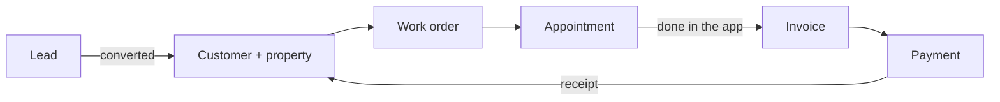

import { Touches } from "/snippets/touches.mdx";

<Touches systems="zoho-crm, supabase-backend, the-7am-app, quickbooks, pay-page, resend" />

Comfort Hub sells, installs, services and maintains heating and cooling equipment for homeowners. Every piece of equipment a customer buys becomes an **asset** on their account, and that asset is what brings them back. It needs fixing, it needs looking after, and it is covered by a warranty or by a plan.

## Every visit has the same shape

A **work order** says what the job is. A **service appointment** puts a technician at the property on a day. The technician does the work in the app and taps Complete. An **invoice** bills the customer. A **payment** settles it. The only things that change from visit to visit are *why* the customer is being visited and *whether* they are billed for it.

## Four kinds of visit

| Visit | Why | Billed? |
|---|---|---|
| Installation | They bought equipment | Yes |
| Service | Something broke | Yes |
| Maintenance | Yearly upkeep; produces a certificate | Yes |
| Warranty | Covered repair | No |
| Subscription | Plan visit, paid monthly through Stripe | No, logged on the plan instead |

The work order's line items decide this. Every line is billable, warranty, or subscription. The job is only invoiced for what is billable, and a job with nothing billable never makes an invoice.

## Who does what

- **The office works in Zoho.** Leads, customers, booking, checklists, timesheet approvals, and anything that needs a record edited by hand.
- **Supabase is the engine.** It mirrors Zoho both ways, makes the billing decision, builds invoices, talks to QuickBooks, sends the emails, and runs the phone. Nothing here is edited by hand day to day.
- **Technicians work in the 7AM app.** Their day, the work order, checklists, parts, quotes, hours, time off, the phone and texts.
- **QuickBooks holds the money.** Customers, items, invoices, payments. It is the one that tells us a payment happened.
- **The customer sees email and the pay page.** A booking confirmation, an invoice with a link to pay, and a receipt.

## The chapters

The rest of the handbook walks this loop in order. Each chapter opens with a page like this one, then has a short page per task.

<Columns cols={2}>
  <Card title="New customers" href="/handbook/new-customers/how-a-lead-becomes-a-customer">From a lead to a customer with all their records.</Card>
  <Card title="Booking" href="/handbook/booking/how-booking-works">The work order, the appointment, the billing decision.</Card>
  <Card title="On site" href="/handbook/on-site/a-visit-in-the-app">What the technician does in the app.</Card>
  <Card title="Invoicing" href="/handbook/invoicing/how-invoicing-works">How Complete becomes an invoice.</Card>
  <Card title="Payments" href="/handbook/payments/how-payments-work">The pay page, QuickBooks, the receipt.</Card>
  <Card title="Keeping it running" href="/handbook/running/how-sync-works">Sync, alerts, and what to do when one arrives.</Card>
</Columns>

## Related

- [The customer lifecycle](/handbook/the-business/the-customer-lifecycle)
- [How it all fits together](/systems/how-it-all-fits-together)
- [Who is the source of truth](/systems/who-is-the-source-of-truth)
