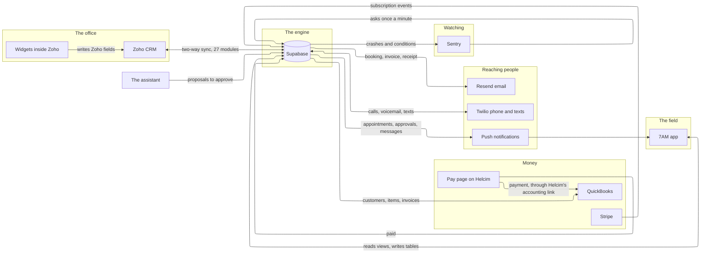

Eight systems have a page here. Two of them, Zoho and Supabase, are the spine. Everything else hangs off Supabase, and Sentry watches it from outside.

## Reading the map

- **Zoho and Supabase mirror each other.** A change on either side crosses over within a minute. Which side wins for each field is fixed in advance; see [Who is the source of truth](/systems/who-is-the-source-of-truth).
- **The widgets never write to Supabase.** They write a Zoho field, and the sync carries it over. That keeps one door into the engine.
- **The app talks only to Supabase.** It reads prepared views and writes a small set of tables. It never talks to Zoho or QuickBooks directly.
- **QuickBooks is told about invoices.** A payment taken on the pay page is recorded in Supabase, and Helcim's own accounting link writes it into QuickBooks; the engine does not.
- **Email goes out through one door**, and that door redirects every message to the owner's inbox until the allowlist is widened on purpose. See [Email safety](/handbook/running/email-safety).
- **Sentry watches from outside.** The engine sends it every crash and every condition the monitor opens; Sentry asks the engine once a minute whether a technician can still read their work; and Sentry, not the engine, emails the owner. See [Sentry](/systems/sentry).

## The systems

<Columns cols={2}>
  <Card title="Zoho CRM" href="/systems/zoho-crm">The office's system of record.</Card>
  <Card title="The Supabase backend" href="/systems/supabase-backend">Database, sync, workers, monitor, functions.</Card>
  <Card title="The 7AM app" href="/systems/the-7am-app">The technicians' iPhone app.</Card>
  <Card title="QuickBooks" href="/systems/quickbooks">Customers, items, invoices, payments.</Card>
  <Card title="Stripe" href="/systems/stripe">Subscriptions only.</Card>
  <Card title="Twilio" href="/systems/twilio">The phone line and texts.</Card>
  <Card title="Resend" href="/systems/resend">Transactional email.</Card>
  <Card title="Sentry" href="/systems/sentry">Crashes, conditions, the uptime check, the emails.</Card>
</Columns>

## Related

- [How Comfort Hub runs](/handbook/the-business/how-comfort-hub-runs)
- [Who is the source of truth](/systems/who-is-the-source-of-truth)
- [Environments and secrets](/systems/environments-and-secrets)
