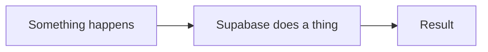

import { Touches } from "/snippets/touches.mdx";

<Touches systems="zoho-crm, supabase-backend" />

Open with the one sentence you would say out loud if someone asked how this works.

## The shape of it

A short walk through the steps, in order. A small diagram helps when three or more systems are involved.

## Why it works this way

The decisions that were made and the trade-off behind each. This is the part you will thank yourself for in three months.

## What can go wrong

The known failure modes, each with a link to the how-to that fixes it.

## Related

- [A how-to in this chapter](/handbook/writing-here)
- [The system page](/systems/supabase-backend)
- [A reference table](/reference/statuses)
